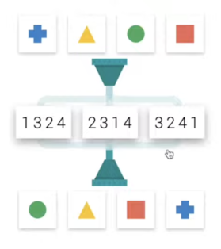
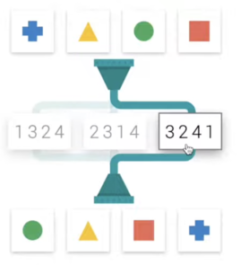

# Solution to AON's Switch Challenge

### Introduction
This program is designed to solve the Switch Challenge. It's a straightforward tool that allows you to input color combinations and receive the correct number sequence as a solution. This README provides essential information on how to effectively use the program.

### How to Use
1. **Basic Usage:**
   - To start, run the program.
   - To exit at any time, type 'q'.
   - Input the first letter of the colors of the objects in the order you see them.
   - For example, inputting `comb1: 'gbry'` and `comb2: 'bygr'` will return `2413`.

2. **Advanced Level (Switch to Level 2):**
   - When required to select multiple numbers, type 'sw' to switch to level 2.
   - Start by inputting the two combinations of colors, similar to level 1.
   - Then, enter each row of numbers, separated by commas.
   - After entering all rows, press enter again to receive the solution.
   - For instance:
     ```
     comb1: 'gryb'
     comb2: 'rbgy'
     numbers: '2341,2431,3241'
     numbers: '2341,2431,3241'
     numbers: ''
     ```
     This will return `[3241, 2341]`, indicating the numbers to select for the respective rows.

### Example
Here's an example of how you would input the data and the expected output:



```bash 
comb1: 'bygr'
comb2: 'gyrb'
output: 3241
```


